# CRISP--Content-based-Rapid-Image-Seach-using-Parallel-Computing

#### CRISP is a Content-based Image Search application that is capable of retrieving similar images of query image input from a database of images. This system uses the concept of parallel computing to speed up the search thus reducing the time required to retrieve the images. 

 

### 🖥️ Technologies and Tools used

#### 📊 Get Presentation Here  

#### 🗃️ Dataset
[INRIA Holidays dataset](https://lear.inrialpes.fr/~jegou/data.php) has been utilized to demonstrate the image search.

 

## ABSTRACT

With the massive  growth of the internet, people can gain access to a massive amount of information. Due to this retrieving the information of interest becomes very difficult. If focused on visual information, the internet contains several kinds of images and other visual information, such as videos, movies in various formats such as JPG, PNG, BMP and even GIF. Hence there is a need for such an image search engine using which the related and exact images can be searched. Content-based image retrieval seeks to find
methods to index, browse, and query large image databases by using meaningful feature extraction and comparison methods for images. CBIR system uses feature extraction which is the process of obtaining the most relevant information from the original image and represent it in a reduced representation of a set of features like texture, shape using algorithms which process the image data and store them. 
But to implement such kind of algorithms in real-world applications we need the algorithm to be executed in the least time possible so as to increase the performance of the system. This speed-up of performance can be achieved since feature extraction and comparison of visual features used for the content-based image retrieval can be realized by using the concept of parallel computing. Since the algorithms dealing with the extraction process are huge and complex, with the help of parallelization this heavy process can be divided into multiple smaller tasks and execute them at the same time. The main purpose of parallelization is to provide simultaneous execution of two or more parts of the program to utilize the CPU resources to the maximum increasing CPU utilization. This helps the program to run faster, smoother, and much efficient in resource utilization. Thus, the implementation of parallelization in image search could greatly reduce the retrieval time and improve the performance of retrieval system which is critical in any search applications. Since users usually work with a huge number of images, it is important to achieve the highest performance possible from that code. To achieve this, we make use of parallelization.

 

## INTRODUCTION

Huge collection of digital images is collected due to the improvement in the digital storage media, image capturing devices like scanners, web cameras, digital cameras and rapid development in internet. Due to these reasons there is a need to implement new programs in such a that it gives the best performance using the same resources as before and at the same time reducing the time to retrieve images from the system. Image retrieval is achieved through low level features that are extracted from the images by the extraction algorithm and then these features are represented in a form called feature vector. These feature vectors are calculated statistical values like standard deviation. Similarity is measured to rank the images by calculating the distance between the query image feature vector and feature vectors of database images. Since this algorithm performs various number of computations in order to obtain the feature vectors for the image it usually executes the computation sequentially and finally obtain the required results. This method works but in order to increase the CPU utilization of the multi-processor systems to the maximum and to reduce the computation time we can make use of multithreading. 
With the help of multithreading heavy processes can be divided into multiple threads and execute them at the same time. With the application of multithreading into this process instead of sequentially computing the data, each thread can take a particular function assigned to them and these threads execute simultaneously and when joined gives back the result of the computation assigned to them. Here in this method each thread can handle the calculation of various tasks like data extraction, histogram refinement, calculation of feature vectors and finally produces the results of the computation simultaneously at the same making the process execution a whole lot faster since computation is performed in parallel rather than serial execution. Thus, have achieved the goal of improving the performance of the system with the use of multithreading to enable efficient and fast execution of the program.

 

## PROPOSED ARCHITECTURE

 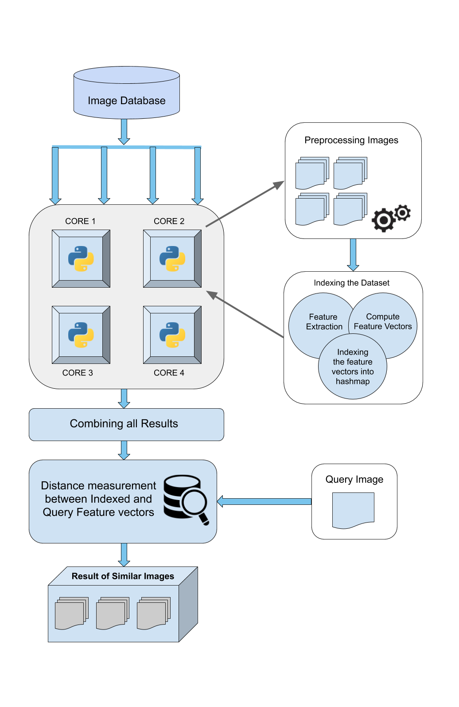

The proposed architecture consists of primarily three modules which are preprocessing, indexing image, query searching. Firstly, the whole image database paths are parsed and stored in a list data structure. With the help of multithreading library, each core of the system can be assigned certain number of images thus dividing the total workload and processing the image data in parallel. Each core processes the images, indexes the features vectors it had extracted from the image and as each core completes indexing, the vectors are stored in a combined hash table with the key being the name of the image and the value being the respective feature vector of the image. The process is applied to the query image as well and it’s feature vector is queried across the hash table values. The metric used to compare the query image vector with the database image vector will be a chi-square distance measurement and the distance metric results obtained with be sorted, and top 20 results will be returned.

### Preprocessing
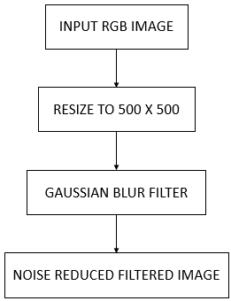

The first step in preprocessing will be process of noise reduction. Mostly images consist of some noise and unwanted information. They should be removed from images before processing for retrieval by using filters. Different filters method can be used for removal noise. A gaussian blur is applied on images for enhancement in the preprocessing step. The input image will be an RGB image of dimensions more than 2000 x 2000 which shall be reduced to 500 x 500 for ease of computation and to limit memory usage. 

 

 

 

### Feature Extraction

 

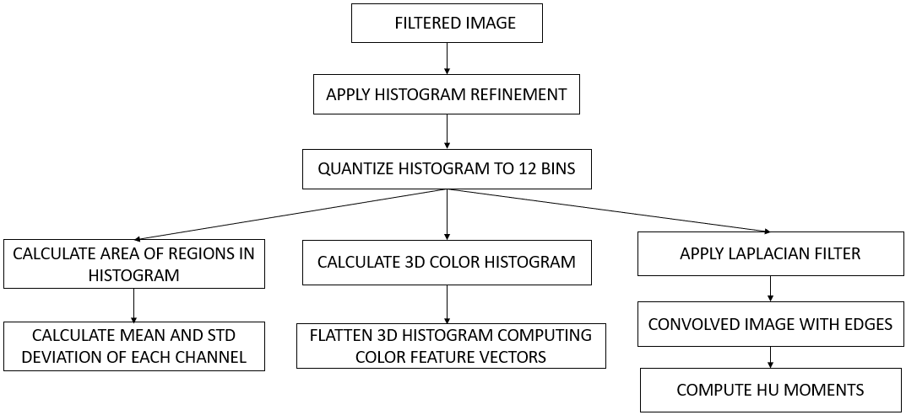
  
For feature extraction the color histogram refinement technique is used. Color histogram is quantized into 256 bins. Each bin is divided into connected regions of pixels using 4-neighborhood rule. The number of regions in each bin is determined. Then the area of each region is calculated. Two color moments are used to calculate features, the first-order moment called mean and second order moment called standard deviation. The mean represents the brightness of image and standard deviation represents the contrast. The dark image has low mean and bright image has high mean. The low contrast image has low and high contrast has high standard deviations. The means and standard deviations are calculated in each bin using the areas of regions. Color is the most prominent and important feature of image because it is the dominant part of human visual perception. It is used to retrieve images in CBIR. For this purpose, various color methods have been used. In these methods color histogram is popular one and mostly used method. Color histogram has the frequency of occurrence of each color in an image. Color histogram is divided into bins of color and each pixel having a specific color belongs to a color bin of that color. It has the characteristics that it represents the global information of the image. Here we use a 3D histogram of bin size of 12 for each channel having a shape of 12x12x12 which corresponds to 1728 features on flattening. This acts as a color distribution descriptor. 

### Convolution

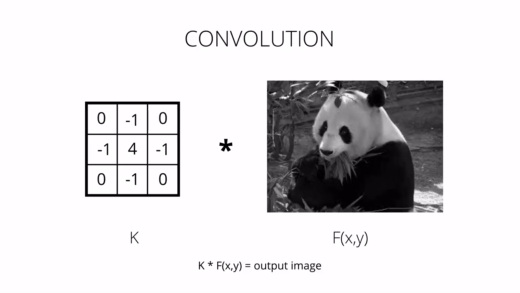

Also, 	as the color images consist of three components therefore the computational cost of feature extraction will be high. To reduce computation cost the color images are converted into grayscale. Now a convolution filter laplacian filter is applied which does edge detection, to obtain a filtered image with edges of objects in image. Hu Moments are normally extracted from the silhouette or outline of an object in an image. By describing the silhouette or outline of an object, we are able to extract a shape feature vector to represent the shape of the object.

#### Convolutional Kernels &ensp;&ensp;&ensp;&ensp;&ensp;&ensp;&ensp;&ensp;&ensp;&ensp;&ensp;&ensp;&ensp;&ensp;&ensp;&ensp;&ensp;&ensp;&ensp;&ensp;&ensp;&ensp;&ensp;&ensp;&ensp;&ensp;&ensp;&ensp;&ensp;&ensp;&ensp;&ensp;&ensp;&ensp;&ensp;Convolution of Images

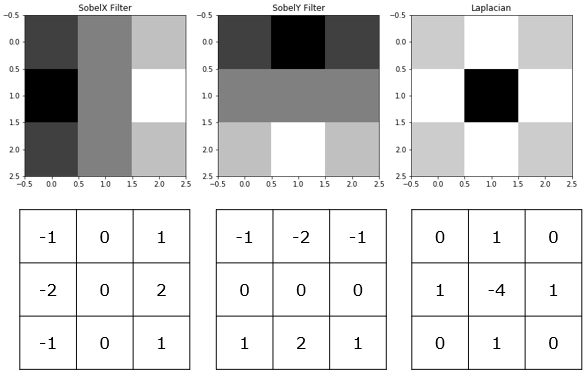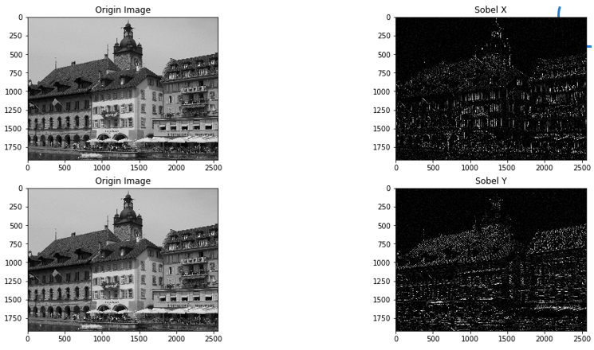

 

#### RGB Histogram

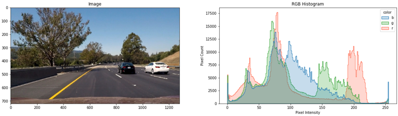

 

 

## IMAGE SEARCH RESULTS

#### Query

&ensp;&ensp;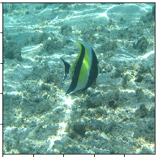

#### Results

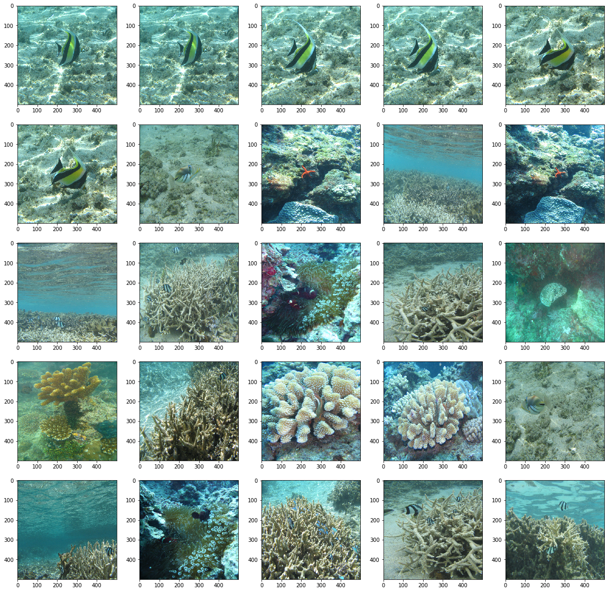

  

#### Query

&ensp;&ensp;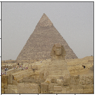

#### Results

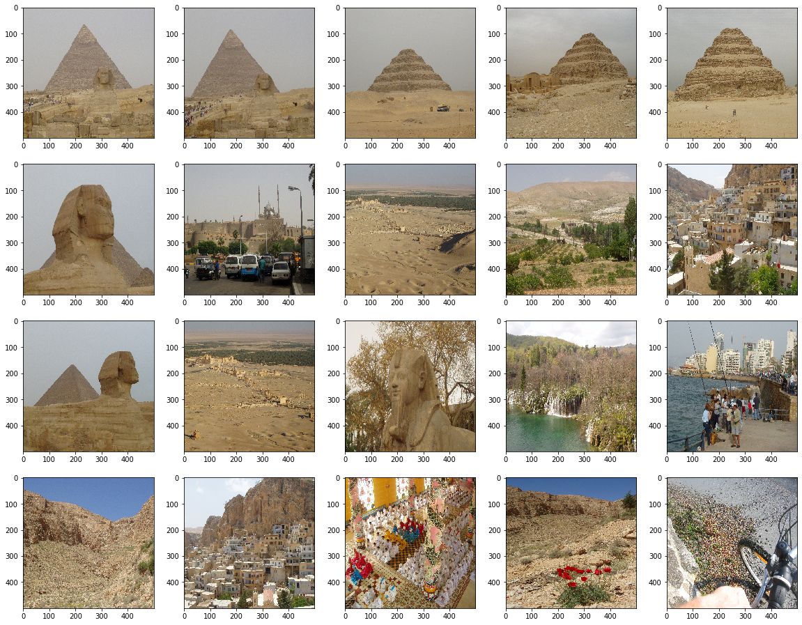

  

#### Query

&ensp;&ensp;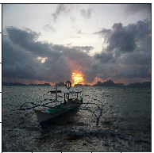

#### Results

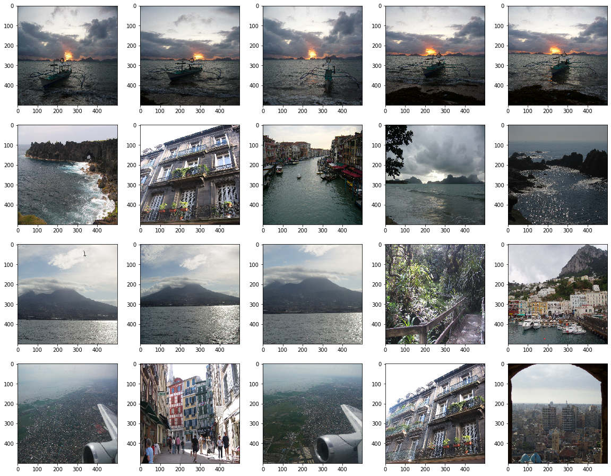

  

## PERFORMANCE EVALUATION

#### Serial vs Parallel Search Execution Time

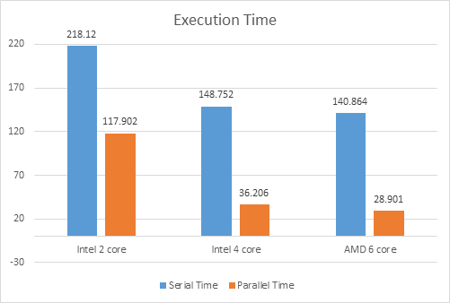

#### SpeedUp

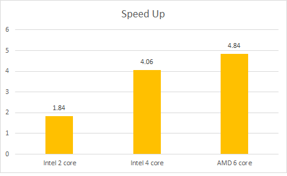

 

 
[📃 Project Report Here](/Docs/Final%20Report.pdf)
